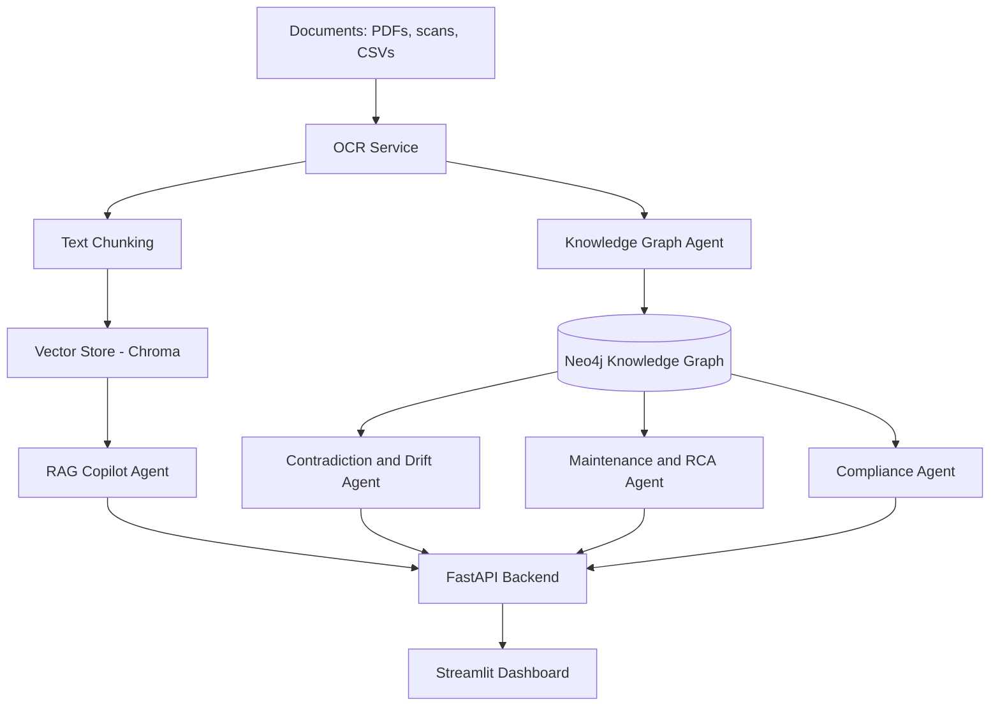
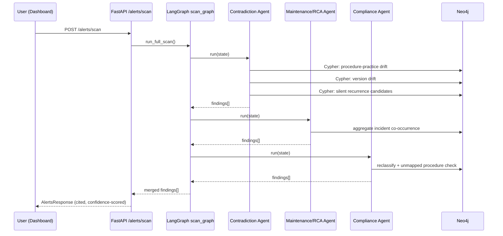
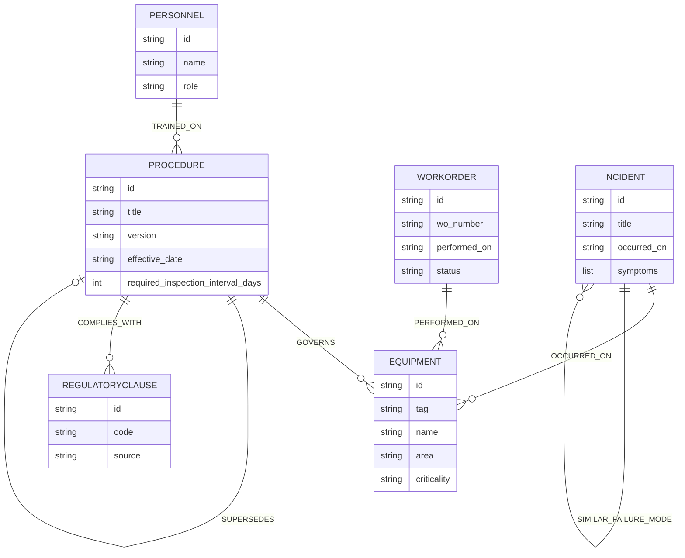
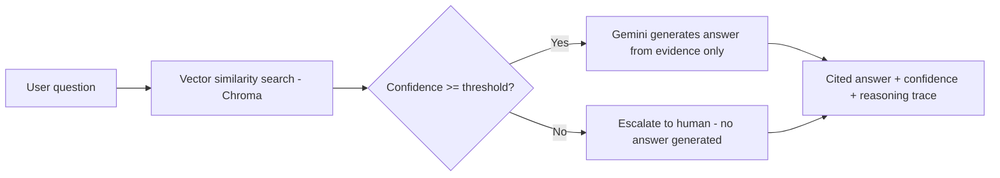

# Mermaid Diagrams

These render natively in GitHub's markdown preview.

## 1. High-level system flow

## 2. Proactive multi-agent scan sequence

## 3. Knowledge graph schema (entity-relationship view)

## 4. Copilot query flow

